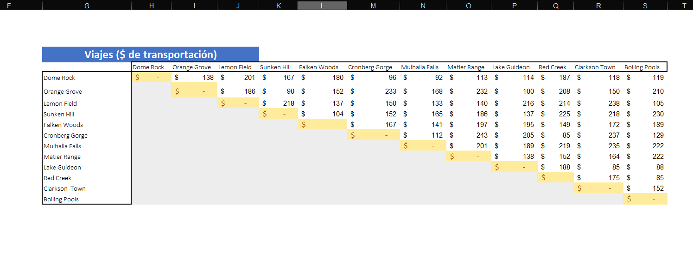
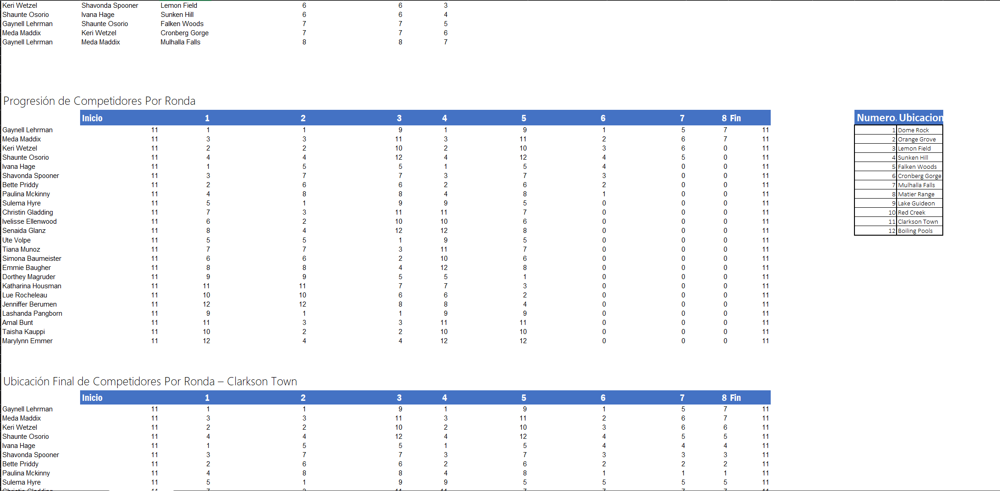
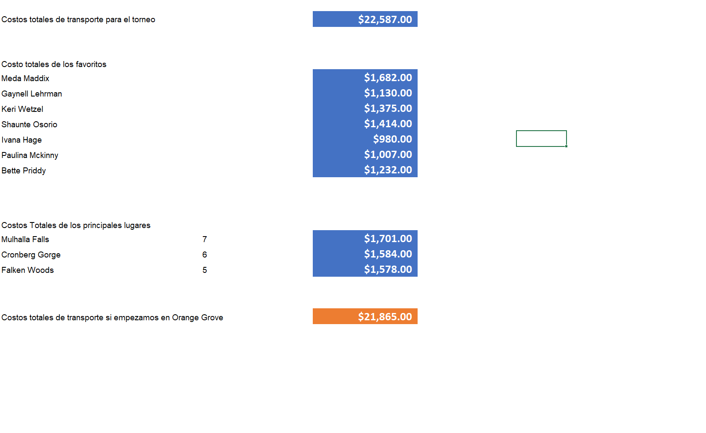

# Logistics & Transport Cost Model: Rock Climbing Championship

The challenge in managing a women's rock climbing championship across a National Park isn't just about scheduling; it's about controlling the underlying transport costs. With 24 athletes competing across 67 different events, manual routing between remote locations quickly becomes a logistical bottleneck and a budget drain. I built this Excel-based model to automate that exact problem.

To solve this, I needed a way to dynamically track where each athlete was in the tournament bracket and calculate the cost of getting them to their next wall. I used a multi-variable distance matrix containing all the park's locations. Instead of mapping routes by hand, the spreadsheet acts as a calculation engine. By combining COUNTIF logic to track athlete progression with nested INDEX and MATCH arrays, the model automatically pulls the precise transit cost for every single movement directly from the raw data.

Snapshot of the multi-variable distance matrix used as the primary data source.

Once the automated tracking was in place, the data allowed for a deeper strategic look at the event's budget. Beyond just calculating the total operational cost, I ran a scenario analysis to see what would happen if we changed the logistical starting hub from Clarkson Town to Orange Grove. The model quantified the exact financial impact of that pivot, identifying clear potential savings. 

Detail of the lookup logic used to extract costs based on origin and destination variables.

Ultimately, this project takes raw tournament schedules and turns them into a segmented budget, isolating costs for high-traffic locations and tracking specific high-profile athletes. It provides a clean, automated answer to the operational costs of the event. 

The next technical step for this kind of logistical problem would be migrating the raw data and routing logic into a relational SQL database, which would allow for scaling the operation to handle multiple tournament schedules simultaneously.

Final budget comparison and optimization output.

Repository contents:
- Logistics_Model_Final.xlsx
- raw_tournament_data.csv

Note: The dataset and internal formulas are maintained in Spanish as per the original source. This documentation is provided in English for global accessibility.
